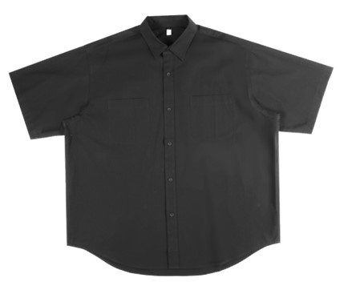
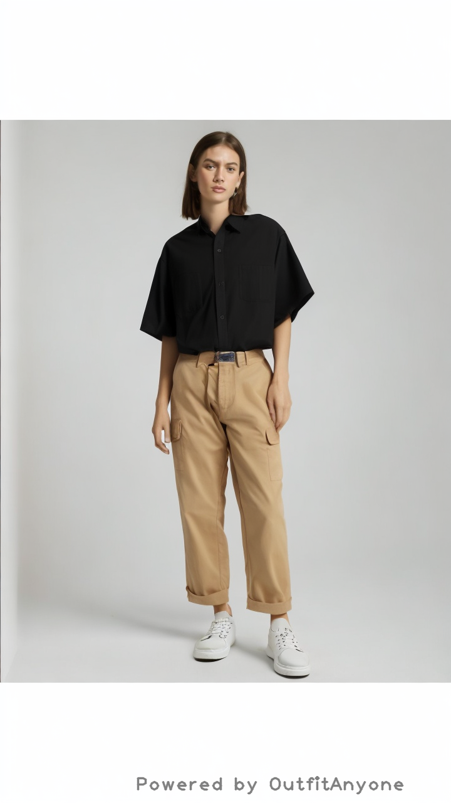

# OutfitAnyoneAPI
API of Outfit Anyone main function


## 环境配置

安装python3，pip3，使用pip3安装依赖

```bash
pip install urllib3
```

确保设备联网

## 使用方法

```bash
python OutfitAnyoneAPI.py
```

其中 input 目录下的 image1.jpg 和 image2.jpg 是输入图片，分别为上装和下装。运行结果会输出到 output 目录下的 result.jpg 中。

## 样例

| 上装 | 下装 | 输出 |
| --- | --- | --- |
|  |  |  |

## TODO

- [x] Python实现 (main)
- [ ] 可更换人物 (main)
- [ ] Java实现 (java)
- [ ] C++实现 (cpp)
